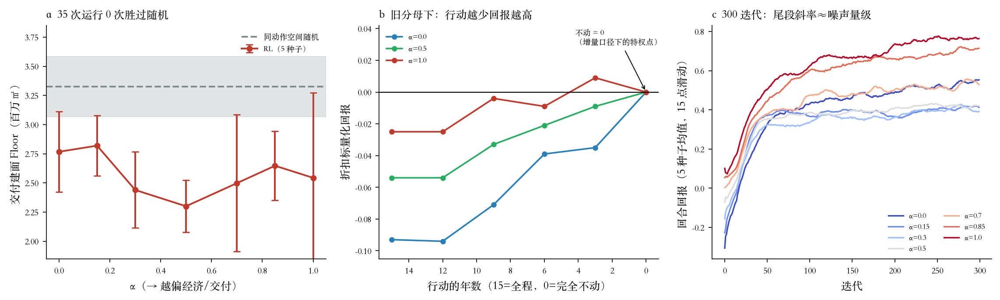

# 奖励口径缺陷：不作为吸引子

本文回答自评 v1 第 4.1 条「交付建面输给同动作空间随机基线」的根因。
**结论：这不是优化失败。策略在正确地优化，是被给定的目标偏好不作为。**
随机基线在 `Floor` 上赢，是因为它不优化。

配置：`BUDGET=900`、`CARRY_CAP=3`、`FAR_GROWTH=0`——即 v1 中 `Floor` 输给随机的那个配置。

## 1. 手工策略直接比较：不动占优（限于该填充实现）

> **§7.2 已限定本节结论的适用范围。** 下表的「填满配额」按某一特定选取规则
> 实现；改为按成本降序买最大单元后，同一分母下回报为**正**
> （+0.056 / +0.137 / +0.197），不动不再占优。本节证明的是
> 「存在一类填充策略劣于不作为」，不是「不作为普遍占优」。

用手工策略绕开训练，直接算折扣标量化回报（γ=0.95，T=15，5 种子均值）：

| 权重 | 完全不动 | 填满配额 | 差（填满−不动） |
|---|---|---|---|
| α=0.0 | **+0.000** | −0.068 | −0.068 |
| α=0.5 | **+0.000** | −0.041 | −0.041 |
| α=1.0 | **+0.000** | −0.021 | −0.021 |

「完全不动」恰为 0，因为空间目标用**逐年增量**口径（见 `reward.py::step_reward`
的说明），不动则增量全为 0，且不产生 `Cost`/`Disrupt`/`Expire`。
而行动在所有三个权重下都是净负的。

把行动的年数从 15 逐步截短，回报**单调上升**：

| 权重 | 全程 | 前12年 | 前9年 | 前6年 | 前3年 | 不动 |
|---|---|---|---|---|---|---|
| α=0.0 | −0.093 | −0.094 | −0.071 | −0.039 | −0.035 | **+0.000** |
| α=0.5 | −0.054 | −0.054 | −0.033 | −0.021 | −0.009 | **+0.000** |
| α=1.0 | −0.025 | −0.025 | −0.004 | −0.009 | **+0.009** | +0.000 |

只有 α=1 且仅动前 3 年才勉强转正。这解释了 v1 里 α=1 那三个「零立项」年份：
不是期权行使，是策略找到了真正的（局部）最优——少做。

**但要注意本节的适用范围**：以上是**随机填满配额**与不动的比较。加大训练后
（300 迭代 × 8 回合 × 5 种子，见 §5）训练出的策略**并不表现为不作为**：
零立项年份为 0，花费率 95–100%，回合回报为正（0.40–0.76）。
即「随机地行动」是净负的，而「有选择地行动」是净正的——策略找到了后者。
不作为吸引子解释的是 v1 在 60 迭代下的退化现象，不是充分训练后的行为。
充分训练后的表现形式是**把 `Floor` 换成别的目标**（§5）。

## 2. 分解：哪一项把回报拖负

α=1（`Floor` 权重最大）下「填满配额」的折扣回报按目标分解（`vec` 已除分母）：

| 目标 | 归一权重 | 贡献 | 实际值/分母 |
|---|---|---|---|
| Floor | 0.256 | **+0.0582** | 3.91e6 / 1.72e7 = **0.23** |
| Res | 0.026 | +0.0190 | |
| Gdp | 0.256 | +0.0138 | |
| E2r | 0.026 | +0.0039 | |
| Cpt | 0.026 | −0.0062 | |
| Emp | 0.256 | −0.0165 | |
| Expire | 0.051 | −0.0201 | 3.2 / 8.06 = 0.40 |
| Cost | 0.051 | −0.0207 | 802 / 1988 = 0.40 |
| Disrupt | 0.051 | **−0.0365** | 2.28e4 / 3.20e4 = **0.71** |
| **合计** | | **−0.0050** | |

权重本身不是问题：α=1 时 `Floor`+`Gdp`+`Emp` 合计归一权重 0.768，
三个惩罚项合计仅 0.153。问题在**分母**。

## 3. 根因：分母的差异性失真

`scale` 取自 `reward_v0/discounted_return.csv` 的各目标绝对值上界，
而该基线表是在**另一套（无预算约束的）情景**下算的。结果：

- `Floor` 的分母 1.72e7 是预算约束下**可达值** 3.9e6 的 **4.4 倍**——收益被低估 4.4 倍；
- 惩罚项的分母只有可达值的 1.4–2.5 倍（`Disrupt` 1.4×、`Cost`/`Expire` 2.5×）。

这不是一致的缩放，而是**收益项相对惩罚项被系统性压低**，足以翻转符号。

**验证（决定性）**：只把 `Floor` 的分母换成同动作空间可达值 3.265e6，其余全部不动：

| 权重 | 旧分母·全程 | 仅修 Floor 分母·全程 | 不动 |
|---|---|---|---|
| α=0.0 | −0.093 | **−0.093（分毫不变）** | +0.000 |
| α=0.5 | −0.054 | **+0.070** | +0.000 |
| α=1.0 | −0.025 | **+0.192** | +0.000 |

α=0 分毫不变是内部一致性检验：α=0 时 `Floor` 权重恰为 0，
修正只应影响真正重视交付建面的权重档——确实如此。这排除了「随手改个常数碰巧变好」。

## 4. 一个未解决的附带发现（见 §7.5）

> **仍未关闭。** 修补 `Cost` 漏项并换分母后，α=0 下不作为仍最优
> （−0.043 对 0.000），范围收窄到 α ≲ 0.3。下列两个解释仍未区分。

α=0（生态优先）下即使修了 `Floor` 分母，不作为仍然最优（−0.093）。
两种可能，本文未区分：
(a) 生态优先确实应当反对拆建，这是正确的偏好；
(b) 更新的生态收益（如新建绿地、能效提升）在目标集中表示不足。
需要看 `Eco`/`Aec` 的增量是否真的能为正——尚未做。

## 5. 多种子实验（300 迭代 × 8 回合 × 5 种子 × 7 权重）

`scripts/exp_opt_quality.py`，配置同上，输出 `data/processed/gm_dataset_v1/exp_opt_v1/`。
相对 v1 提高 5 倍迭代、2 倍回合、加 5 个种子。用时 174 分钟（12 核，10 并行）。

### 5.1 `Floor` 输给随机：确认，且不是欠收敛

35 次运行中 **0 次**超过随机基线的 `Floor` 均值（3.33e6），也 0 次超过随机最好（3.70e6）。
按权重档的均值 2.30e6–2.82e6，全部低于随机 15%–31%，差距远超种子标准差。
加大训练**没有**缩小差距——因此不是欠收敛。

同时，策略在 11 个目标里**胜 9 个**，其中数个是量级差异：

| 目标 | 随机基线 | RL 最好（档） | 判定 |
|---|---|---|---|
| Gdp | 239 | 3510（α=0.85） | 胜 |
| Emp | 69 | 1771（α=0.85） | 胜 |
| Eco | −61 | +2821（α=0.15） | 胜（符号翻转） |
| Aec | −838 | +4185（α=0.5） | 胜（符号翻转） |
| Disrupt | −1.30e4 | −1429（α=0.15） | 胜（干扰少 9 倍） |
| Expire | −4.57 | −2.23（α=0.85） | 胜 |
| Res / E2r / Cpt | — | — | 胜 |
| **Floor** | **3.33e6** | **2.82e6（α=0.15）** | **负** |
| **Cost** | **−801** | **−1214（α=0.15）** | **负** |

（全部已按 `SIGN` 方向归一，越大越好。）

所以这不是优化失败，而是一笔**连贯的交换**：策略多花钱、少交付建面，换来
空间目标的大幅改善与施工干扰的大幅下降。而这笔交换之所以对策略有利，
正是因为 §3 的分母把 `Floor` 定价压到了应有的 23%。
**根因与 §3 是同一条，只是表现形式在充分训练后从「不作为」变成「换掉 Floor」。**

### 5.2 前沿支配：已解决，但证据强度有限

7 个权重档在 5 种子均值上**全部非支配**，且 5 个种子逐个都是 7/7。
v1 的被支配问题消失。
但 11 维下非支配的门槛很低——维数越高越容易互不支配，
所以这条只说明「不再出现明显退化」，不能说明前沿质量好。

### 5.3 收敛性：改善但未完全解决

末 50 迭代的斜率（×50，与噪声同量纲）与噪声对比：

| α | 末50均值 | 末50噪声 | 末段斜率×50 | 种子间标准差 |
|---|---|---|---|---|
| 0.00 | 0.534 | 0.065 | **+0.057** | 0.064 |
| 0.15 | 0.410 | 0.048 | +0.009 | 0.011 |
| 0.30 | 0.405 | 0.051 | −0.018 | 0.054 |
| 0.50 | 0.418 | 0.046 | −0.000 | 0.019 |
| 0.70 | 0.527 | 0.060 | +0.034 | 0.075 |
| 0.85 | 0.705 | 0.064 | +0.035 | 0.051 |
| 1.00 | 0.762 | 0.069 | +0.008 | **0.142** |

α=0.15/0.30/0.50/1.00 的尾段斜率已落到噪声以下，可视为收敛；
α=0.00/0.70/0.85 仍在上升（斜率 0.034–0.057，与噪声 0.06 相当），未收敛。
种子间标准差 0.011–0.142：α=0.15/0.30/0.50 三档的回报（0.405–0.418）
彼此**无法区分**；但它们与 α=0.85/1.00（0.705–0.762）的差异远超种子噪声，可以区分。
v1 中「整个训练增益与末段噪声同量级」的问题已缓解，但对 α=0/0.70/0.85 仍需更长训练。

### 5.4 两条运行层面的观察

**α=1.0 的耗时是其他档的 3.2 倍**：各权重档单次运行 1505–1603s，而 α=1.0 的
5 次均为 4864–4897s。它们跑在最后一批（5 个作业占 10 个进程位），机器竞争**更少**，
所以不是竞争造成的，是真实的计算量差异。向量化后每迭代耗时本应与策略行为无关，
故此处仍有一个未定位的规模因素——推测与候选集大小随策略行为的演化有关
（立项越少，未立项候选集越大，网络前向的行数越多），但**未验证**。
影响后续成本估算：按最慢档规划，不能用其他档的耗时外推。

**α=1.0 的种子 2 是离群点**：立项 45.0（其余种子 15.0–24.4）、花费率 0.746
（其余 ≥0.995）、`Floor` 1.29e6（其余 2.56e6–3.11e6）。§5.3 中 α=1.0 的
种子间标准差 0.142（全部权重档最大）主要由它造成。未排除，也未单独诊断。

## 6. 这条缺陷波及的既有结论

- **4.1 交付建面输给随机**：已解释，根因在此。非欠收敛。
- **4.2 前沿被支配**：已解决（§5.2，7/7 非支配），但 11 维下门槛低，证据强度有限。
- **4.3 曲线未收敛**：部分解决（§5.3）。α=0.15/0.30/0.50/1.00 已收敛；
  α=0.00/0.70/0.85 尾段斜率仍与噪声同量级，需更长训练。
- v1 及之前**所有**目标数值，以及本文 §5 的多种子结果，都是在这套分母下算的。
  修分母会使它们全部作废，需重跑，不可与新数保留在同一张表里比较。
  §5 的价值在于**证明根因不是欠收敛**，而不在于其目标数值。

## 7. 决定：先补 `Cost` 漏项，再改用约束情景下的可达上界

> 本节所有数字均为**修补 `Cost` 漏项之后**测得。修补前的数字（含本文更早
> 版本 §7 的三方案表）已作废，不可引用。

### 7.1 前提：`Cost` 目标漏掉了拆除补偿基数（v1 修补只做了一半）

`env_gym.py` 顶部注释早已诊断过「只用 `CCM` 计资金是错的」——`CCM` 对角线
为 0，于是「原类重建」不花钱却照样计入交付建面。但当时 `CELL_COST` 只加进了
**预算路径**（`pair_cost`/`PC`），漏掉了 **`Cost` 目标**（`reward.convert_cost`）。
后果是预算确实咬住，而 `Cost` 目标对这类动作报 **0**。

实测规模：首年 1985 个可选配对中 **361 个（18.2%）是纯自转换**——每个格子的
目标类别都等于现状类别。「买最便宜」策略正好把配额全填给它们：15 年 26 次
获批、16 个单元建成，交付 75.7 万㎡建面，而 `Cost` 目标合计 **0**、7 项空间
目标也**恰好全为 0**（用地图被改写成同一类别，逐年增量为零）。

修补：`CELL_COST` 移到 `objectives/reward.py` 单一定义，`convert_cost` 改为
`(CELL_COST + CCM[现状,目标]) × 格数`，`env_gym` 从该处导入。修补后
`pair_cost(u,tg) == Σ convert_cost(f,tg,c)` **按构造相等**，已加不变量检查
（240 组抽样 0 组不符）。「买最便宜」的 `Cost` 由 0 变为 −470，且该策略在
**全部 7 个权重档一律为负**——自转换被正确定价为「花钱且无空间收益」。

这条缺陷位于全部下游结论的上游：它使动作空间的近五分之一被错误定价。

### 7.2 三方案实测（修补后）

手工策略的折扣标量化回报，8 种子均值（`BUDGET=900`、`CARRY_CAP=3`、无增长）：

| 分母方案 | α=0 | α=0.5 | α=1.0 | 跨 α 极差 |
|---|---|---|---|---|
| **约束情景可达上界（采用）** | −0.043 | **+0.358** | **+0.656** | **0.699** |
| 相对基线优势（方案③） | +0.532 | +0.395 | +0.293 | 0.239 |

**方案②（跨策略极差）被否**（结构性理由，不依赖数值）：当前分母本已是跨策略
的，换成极差只换统计量、不换情景。且惩罚项分母缩得比收益项更多，
**差异性失真加剧**。

**方案③（相对基线优势）被否**：以「随机顺序填满」为基线，「完全不动」在 α=0
的优势 **+0.576**，仍高于「买最大」的 +0.532——不作为依旧占优，说明它只平移
原点、不消除该吸引子。更关键的是它把权重依赖压平：买最大的优势跨 α 极差
仅 0.239，不足方案① 的 0.699 的三分之一，前沿会明显收窄。

### 7.3 采用的做法

`src/tpmorl/rl/scale.py`：在**实际约束情景**下重跑 4 种选取规则 × 5 个种子
共 20 个手工参考策略，取逐目标折扣回报作分母。参考集**不含** RL 策略，
避免分母依赖被评估对象。按 (budget, carry, growth) 缓存到
`data/processed/gm_dataset_v1/scale_v2/`，并在起进程池前落盘（否则 workers
会竞争写同一文件）。

**分母估计量：先按策略对种子取均值，再跨策略取绝对值上界。** 不直接对全部
rollout 取 max——max 把策略差异与种子运气混在一起，且对重尾目标不收敛：
`Eco` 的 max 随种子数单调爆涨（3/5/8 种子 → 366.8 / 627.7 / 1239.8，
每加种子近乎翻倍），分母全凭参考集大小，不可复现。改为先对种子取均值，
量的是「策略选择能把该目标推动多少」——这正是加权和里分母应有的含义，
实测 3→8 种子的漂移收敛到 0.52–1.17 倍，多数目标在 0.7–1.0。

新旧分母之比（`旧/新`，>1 表示旧分母偏大、该目标被低估）：

| 目标 | 旧/新 | 目标 | 旧/新 |
|---|---|---|---|
| Eco | **10.85** | Aec | 2.58 |
| Emp | 6.56 | E2r | 2.51 |
| Floor | 5.94 | Disrupt | 2.05 |
| Cpt | 4.46 | Expire | 1.26 |
| Gdp | 2.36 | Res | 1.01 |
| | | Cost | **0.67** |

失真跨度约 16 倍且**方向不一致**——收益项普遍被压低，而 `Cost` 反被放大
（修补后 `Cost` 量级变大，新分母 2984 > 旧 1988）。这比先前
「只有 `Floor` 有问题」的判断宽得多。

### 7.4 两处必须纠正的旧结论

**(a) §1「不动严格占优」过强。** 该表的「填满配额」按某一特定选取规则实现；
改为按成本降序买最大后，同一分母下回报为正。本节证明的是「存在一类填充策略
劣于不作为」，不是「不作为普遍占优」。

**(b) 本文更早版本称「一行启发式的 `Floor` 比 RL 最好值高 19%」——该结论
不成立，是单种子比较造成的假象。** 那两个数各来自**一个**种子：3.36e6 是
「买最大」5 个种子里最幸运的一个，2.64e6 是「随机填满」最不利的一个。
5 种子实测：买最大 2.62e6 ± 0.68e6，随机填满 2.90e6 ± 0.72e6——
**买最大并不优于随机填满，还略低，差异远在种子噪声内。**

仍然成立的是原 §5.1 的发现：35 次 RL 运行的最好 `Floor` 为 2.82e6，
低于扫描里 `eval_random` 的 5 种子均值 3.33e6 ± 0.26e6，且 7 个权重档
无一超过。注意该对比取自**修补前**的奖励口径，重跑后须重新判定。
（`eval_random` 与本文的「随机填满」不是同一策略，两者不可互换引用。）

### 7.5 §4 的悬置发现**未**关闭

修补 `Cost` 并换分母后，α=0（生态优先）下**不作为仍然最优**：
买最大 −0.043 ± 0.317 对不作为 0.000。改善是有的（先前为 −0.093），
但没有翻正。逐档看：

| α | 0.00 | 0.15 | 0.30 | 0.50 | 0.70 | 0.85 | 1.00 |
|---|---|---|---|---|---|---|---|
| 买最大 | −0.043 | +0.091 | +0.212 | +0.358 | +0.487 | +0.575 | +0.656 |
| 击败不作为 | 否 | 边界 | 边界 | 是 | 是 | 是 | 是 |

（±1 标准差判定；α=0.15/0.30 均值为正但小于一个标准差。）

所以 §4 列出的两个竞争解释仍未区分，只是范围收窄到 α ≲ 0.3：
仍需查明生态收益（新建绿地、能效提升）在目标集中是否表示不足。
**本文更早版本称该发现「已关闭」，系在 `Cost` 缺陷未修、且用不稳定的
max 分母下得出，不成立。**

### 7.6 使用约定（必须遵守）

1. 分母依赖 (budget, carry, growth)。**跨情景的标量化回报不可比**
   （`curves.csv`、学习曲线、`最终回报`）。跨情景对照请用
   `objectives.csv` / `pareto_front.csv` 的 11 维目标值——那些是
   `evaluate()` 乘回 scale 后的**原始量纲**，与分母无关。
2. `Cost` 漏项的修补改变了奖励本身，**不只是分母**。本文 §5 的全部结果
   （含目标值）都需重跑，`scale_v2/` 下修补前生成的缓存必须删除重建。
   §5.1 的方法论结论（`Floor` 落后不是欠收敛）不依赖具体数值，仍成立。
3. 参考集是手工策略，只保证同量级，不是可达集的真实上界。

### 7.7 已试而失败的做法（保留记录）

把**全部**目标按「填满配额」**单一**策略的可达值归一：α=1 反而更负，
因 `Emp` 在该策略下可达值极小，把一个负项放大了十余倍。改用多策略参考集后
病态消失。**单一策略的量级不能当分母，参考集的多样性是必要条件。**
